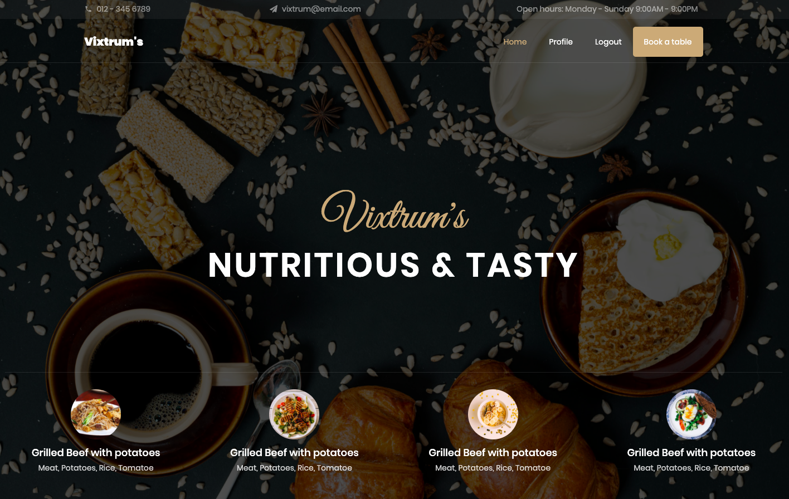

# Restaurant Reservation built with Python Django 3.0 in 3 days 

## Frameworks

- Front-end Framework / language : **HTML, CSS, Bootstrap, Javascript & Jquery**  
- Back-end Framework / language : **Python Django 3**  
- Database Framework / language : **SQLite3**  

    ### Integrated with Stripe payment gateway 

## Models
- Customer
- Booking 
- Payment 

## Stripe Payment
    Test Card as below
    - 4242 4242 4242 4242
    - Randam Numbers afterward
